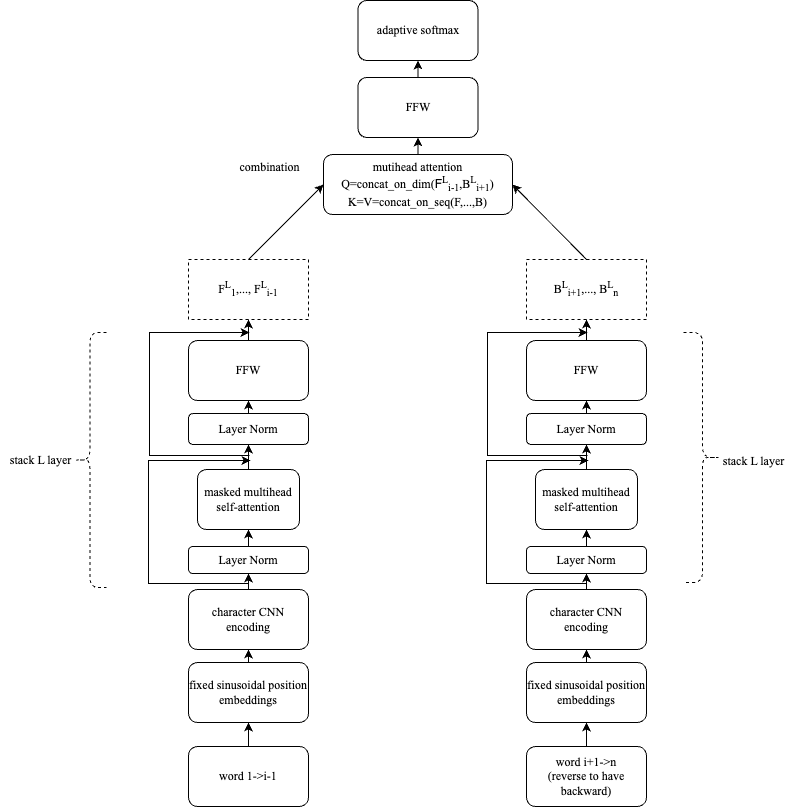
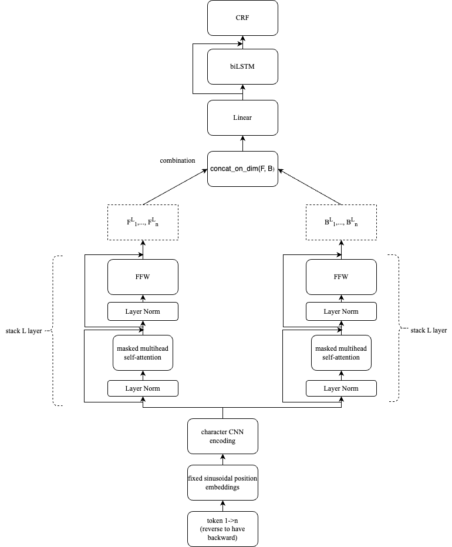

### Cloze-driven network for NER
This code implements the paper in [1]. Some information about dimension, connections in layers on top of two towers is not clear.

### Pretraining model

### Finetuning model

### Some notes
* I only implement the architecture, not processing input, not training.
* I will much appreciate your feedback.

### References
* [1] Baevski, A., Edunov, S., Liu, Y., Zettlemoyer, L., & Auli, M. (2019). Cloze-driven pretraining of self-attention networks. arXiv preprint arXiv:1903.07785.
* CRF implementation: <https://github.com/kmkurn/pytorch-crf/blob/master/torchcrf/__init__.py>, <https://pytorch.org/tutorials/beginner/nlp/advanced_tutorial.html>
